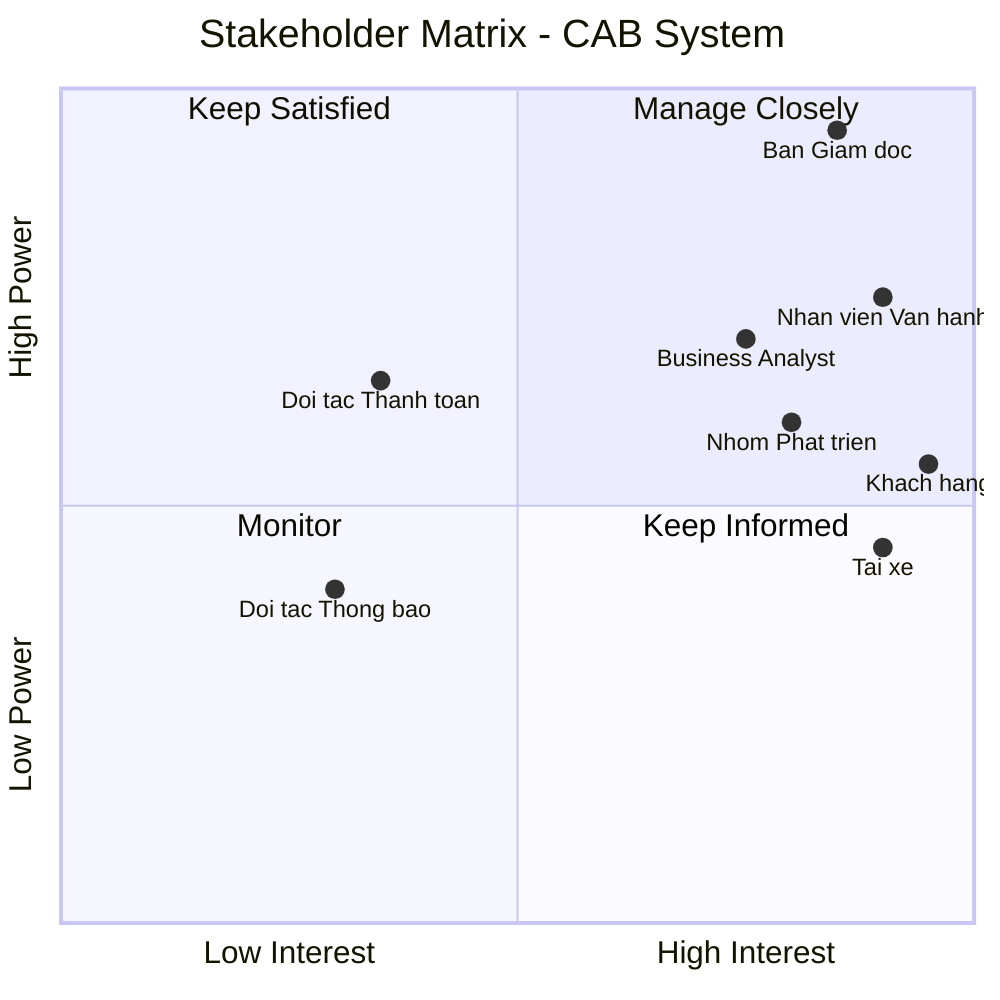
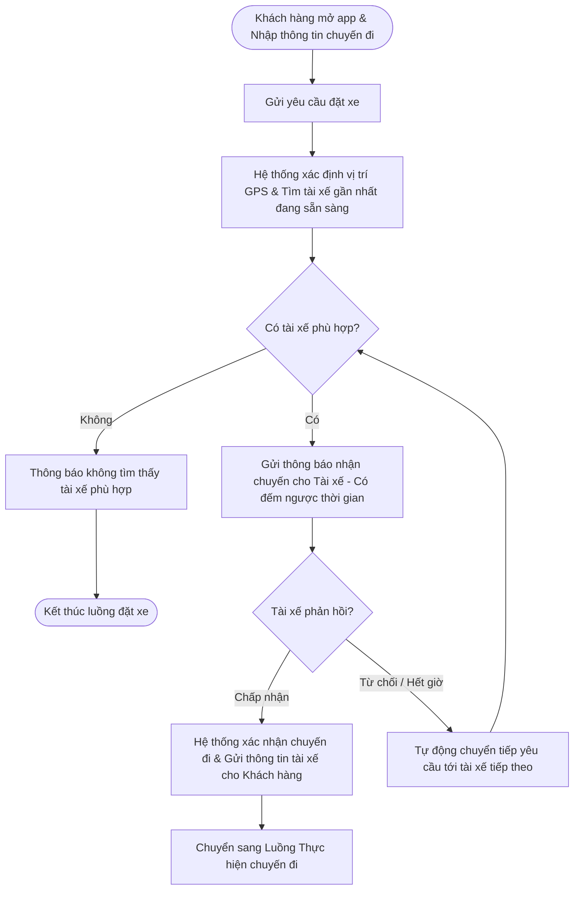
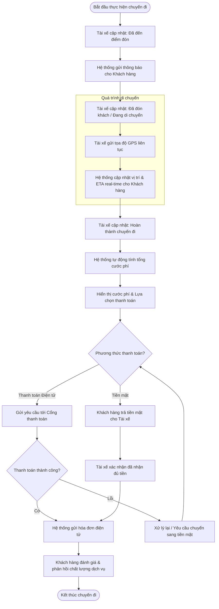

# Software Requirements Specification (SRS) - CAB System

## 1. Stakeholder List & Roles (Danh sách & Vai trò Bên liên quan)

| Stakeholder | Vai trò chính |
| :--- | :--- |
| **Ban Giám đốc** | Ra quyết định chiến lược, duyệt ngân sách và phê duyệt các quy tắc nghiệp vụ. |
| **Khách hàng** | Đặt xe, theo dõi chuyến đi, thanh toán và đánh giá chất lượng dịch vụ. |
| **Tài xế** | Bật trạng thái sẵn sàng, nhận/từ chối chuyến và cập nhật tiến trình chuyến đi. |
| **Nhân viên vận hành** | Theo dõi hệ thống, hỗ trợ xử lý sự cố chuyến đi và quản trị dữ liệu. |
| **Business Analyst** | Làm rõ yêu cầu chưa chốt và chi tiết hóa quy trình nghiệp vụ cho team. |
| **Nhóm Phát triển** | Thiết kế kiến trúc, lập trình và hoàn thiện hệ thống trong 7 tuần. |
| **Đối tác Thanh toán** | Tích hợp xử lý giao dịch điện tử. |
| **Đối tác Thông báo** | Thông báo tức thì đến người dùng. |

---

## 2. Stakeholder Matrix (Ma trận Bên liên quan)

---

## 3. Business Goals (Mục tiêu Kinh doanh)

| ID | Tên Mục tiêu | Mô tả Chi tiết |
| :--- | :--- | :--- |
| **BG01** | Tự động hóa & Mở rộng Vận hành | Tự động hóa quy trình phân công tài xế và tối ưu hóa vận hành nhằm giảm thiểu sự can thiệp thủ công, sẵn sàng mở rộng quy mô hệ thống phục vụ lượng lớn khách hàng và tài xế trong tương lai. |
| **BG02** | Tối ưu Doanh thu & Chuyến đi | Nâng cao doanh thu, tỷ lệ hoàn thành chuyến đi và giảm tỷ lệ hủy chuyến thông qua việc tối ưu cơ chế đề xuất, ghép nối tài xế gần nhất theo thời gian thực. |
| **BG03** | Nâng cao Trải nghiệm Khách hàng | Tăng cường trải nghiệm và độ hài lòng của khách hàng bằng việc minh bạch hóa thông tin trạng thái chuyến đi, vị trí tài xế, thời gian dự kiến đến và đa dạng hóa phương thức thanh toán an toàn. |
| **BG04** | Tối ưu Hiệu quả cho Tài xế | Tăng hiệu quả hoạt động và thu nhập cho tài xế nhờ cơ chế thông báo nhận chuyến chủ động, minh bạch tiến trình chuyến đi và quy trình hỗ trợ vận hành rõ ràng. |
| **BG05** | Nâng cao Năng lực Quản trị | Nâng cao năng lực quản trị, hỗ trợ và xử lý sự cố kịp thời thông qua hệ thống theo dõi trực quan, phân quyền chặt chẽ và công cụ báo cáo hoạt động chuyên sâu. |
| **BG06** | Kiến trúc Nền tảng Linh hoạt | Xây dựng kiến trúc nền tảng ổn định, bảo mật cao, có khả năng mở rộng độc lập và linh hoạt tích hợp/bổ sung các loại hình dịch vụ, đối tác thanh toán hay thông báo mới trong tương lai mà không ảnh hưởng tới hệ thống đang chạy. |
---

## 4. Minimum Viable Product (MVP) Modules

| ID | Tên Module | Mô tả Chức năng chính |
| :--- | :--- | :--- |
| **MOD01** | Quản lý Tài khoản & Định danh (*Account & Auth Module*) | Đăng ký, đăng nhập, quản lý hồ sơ (Khách hàng, Tài xế) và phân quyền quản trị (Nhân viên vận hành). |
| **MOD02** | Đặt xe & Phân công (*Booking & Matching Module*) | Tạo chuyến, định vị thời gian thực, thuật toán tự động ghép nối/tìm tài xế gần nhất và xử lý chuyển tiếp khi từ chối. |
| **MOD03** | Quản lý Tiến trình Chuyến đi (*Trip Management Module*) | Cập nhật/theo dõi trạng thái chuyến đi theo thời gian thực (ETA, vị trí), lịch sử chuyến và đánh giá tài xế. |
| **MOD04** | Tính cước & Thanh toán (*Pricing & Payment Module*) | Tính tiền tự động, hỗ trợ tiền mặt và tích hợp Payment Gateway bên ngoài xử lý thanh toán điện tử. |
| **MOD05** | Thông báo (*Notification Module*) | Gửi thông báo tức thì cho Khách hàng/Tài xế theo từng sự kiện của chuyến đi. |
| **MOD06** | Vận hành & Báo cáo (*Admin & Analytics Module*) | Giao diện quản trị theo dõi chuyến đi, hỗ trợ xử lý sự cố và xuất báo cáo doanh thu, hiệu suất cho Ban giám đốc. |
---

## 5. Business Requirements (Yêu cầu Nghiệp vụ)

| ID | Tên Yêu cầu | Mô tả Chi tiết |
| :--- | :--- | :--- |
| **BR01** | Quản lý Tài khoản & Phân quyền | Hệ thống hỗ trợ đăng ký, đăng nhập, cập nhật thông tin cá nhân và lịch sử hoạt động cho Khách hàng, Tài xế; đồng thời phân quyền truy cập chặt chẽ cho Nhân viên vận hành. |
| **BR02** | Đặt xe & Đề xuất Điều phối | Cho phép Khách hàng chọn dịch vụ, nhập điểm đón/đến và gửi yêu cầu; hệ thống ghi nhận vị trí GPS thời gian thực của Tài xế để tự động tìm kiếm, đề xuất và xử lý nhận/từ chối chuyến. |
| **BR03** | Quản lý Tiến trình Chuyến đi | Cho phép Tài xế cập nhật liên tục các trạng thái chuyến đi (*Đã đến điểm đón, Đã đón khách, Đang di chuyển, Hoàn thành*). |
| **BR04** | Tính cước & Thanh toán | Tự động tính cước sau khi hoàn thành chuyến đi; hỗ trợ thanh toán tiền mặt và tích hợp thanh toán điện tử an toàn qua Payment Gateway bên ngoài. |
| **BR05** | Giám sát & Hỗ trợ Vận hành | Cung cấp giao diện quản trị cho Nhân viên vận hành theo dõi danh sách chuyến đi đang diễn ra, trạng thái Tài xế, tra cứu lịch sử và can thiệp xử lý sự cố. |
| **BR06** | Báo cáo & Đánh giá Dịch vụ | Cung cấp báo cáo thống kê (doanh thu, số chuyến, tỷ lệ hủy, hiệu suất tài xế) cho Ban Giám đốc và cho phép Khách hàng đánh giá (rating/comment) chất lượng phục vụ. |

---
## 6. Business Process Modeling (Mô hình hóa Quy trình Nghiệp vụ)

### 6.1. Luồng Đặt xe & Điều phối Tự động

### 6.2. Quy trình Thực hiện Chuyến đi & Thanh toán

