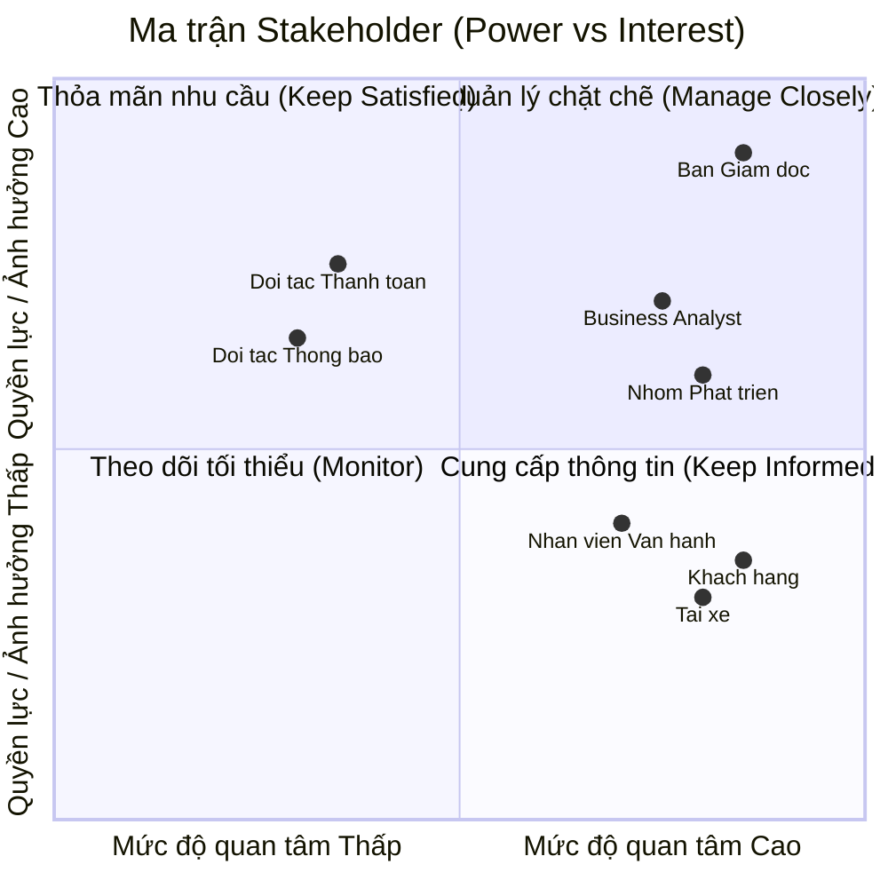

# Software Requirements Specification (SRS) - CAB System

## 1. Stakeholder List & Roles (Danh sách & Vai trò Bên liên quan)

| Stakeholder | Vai trò chính |
| :--- | :--- |
| **Ban Giám đốc** | Ra quyết định chiến lược, duyệt ngân sách và phê duyệt các quy tắc nghiệp vụ[cite: 1]. |
| **Khách hàng** | Đặt xe, theo dõi chuyến đi, thanh toán và đánh giá chất lượng dịch vụ[cite: 1]. |
| **Tài xế** | Bật trạng thái sẵn sàng, nhận/từ chối chuyến và cập nhật tiến trình chuyến đi[cite: 1]. |
| **Nhân viên vận hành** | Theo dõi hệ thống, hỗ trợ xử lý sự cố chuyến đi và quản trị dữ liệu[cite: 1]. |
| **Business Analyst (BA)** | Làm rõ yêu cầu chưa chốt và chi tiết hóa quy trình nghiệp vụ cho team[cite: 1]. |
| **Nhóm Phát triển (Dev/QA)** | Thiết kế kiến trúc, lập trình và hoàn thiện hệ thống trong 7 tuần[cite: 1]. |
| **Đối tác Thanh toán & Thông báo** | Tích hợp xử lý giao dịch điện tử và gửi thông báo tức thì đến người dùng[cite: 1]. |

---

## 2. Stakeholder Matrix (Ma trận Bên liên quan)

---

## 3. Business Goals (Mục tiêu Kinh doanh)

* **BG01:** Tự động hóa quy trình phân công tài xế và tối ưu hóa vận hành nhằm giảm thiểu sự can thiệp thủ công, sẵn sàng mở rộng quy mô hệ thống phục vụ lượng lớn khách hàng và tài xế trong tương lai[cite: 1].
* **BG0c:** Nâng cao doanh thu, tỷ lệ hoàn thành chuyến đi và giảm tỷ lệ hủy chuyến thông qua việc tối ưu cơ chế đề xuất, ghép nối tài xế gần nhất theo thời gian thực[cite: 1].
* **BG03:** Tăng cường trải nghiệm và độ hài lòng của khách hàng bằng việc minh bạch hóa thông tin trạng thái chuyến đi, vị trí tài xế, thời gian dự kiến đến và đa dạng hóa phương thức thanh toán an toàn[cite: 1].
* **BG04:** Tăng hiệu quả hoạt động và thu nhập cho tài xế nhờ cơ chế thông báo nhận chuyến chủ động, minh bạch tiến trình chuyến đi và quy trình hỗ trợ vận hành rõ ràng[cite: 1].
* **BG05:** Nâng cao năng lực quản trị, hỗ trợ và xử lý sự cố kịp thời thông qua hệ thống theo dõi trực quan, phân quyền chặt chẽ và công cụ báo cáo hoạt động chuyên sâu[cite: 1].
* **BG06:** Xây dựng kiến trúc nền tảng ổn định, bảo mật cao, có khả năng mở rộng độc lập và linh hoạt tích hợp/bổ sung các loại hình dịch vụ, đối tác thanh toán hay thông báo mới trong tương lai mà không ảnh hưởng tới hệ thống đang chạy[cite: 1].
