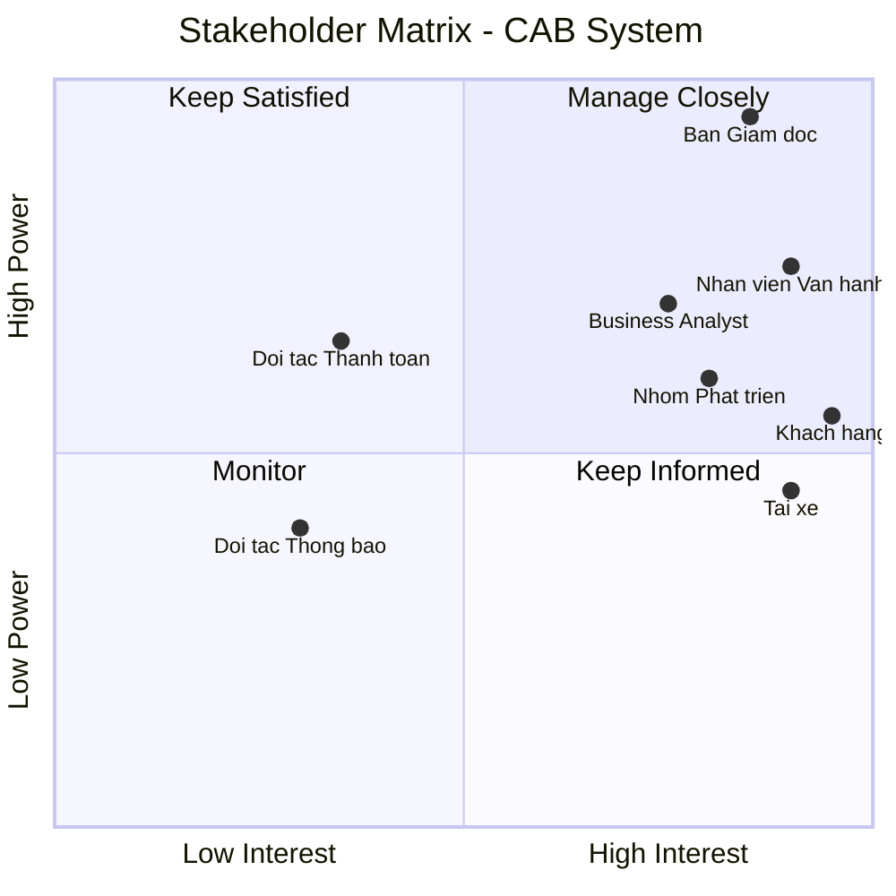
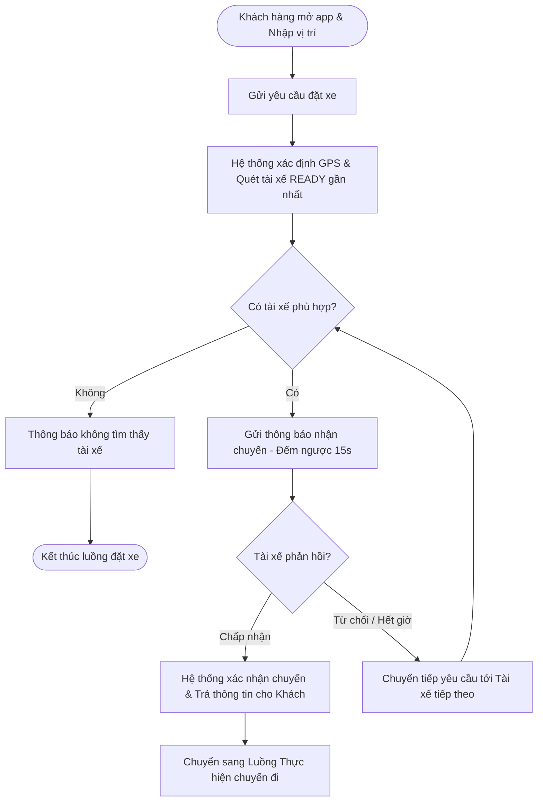
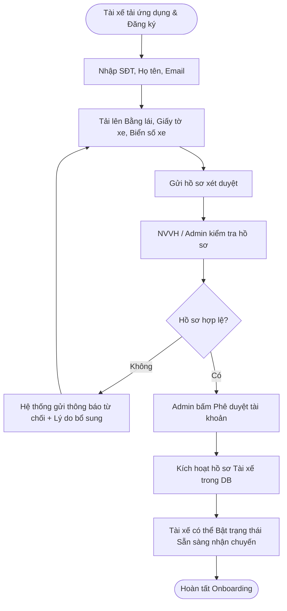
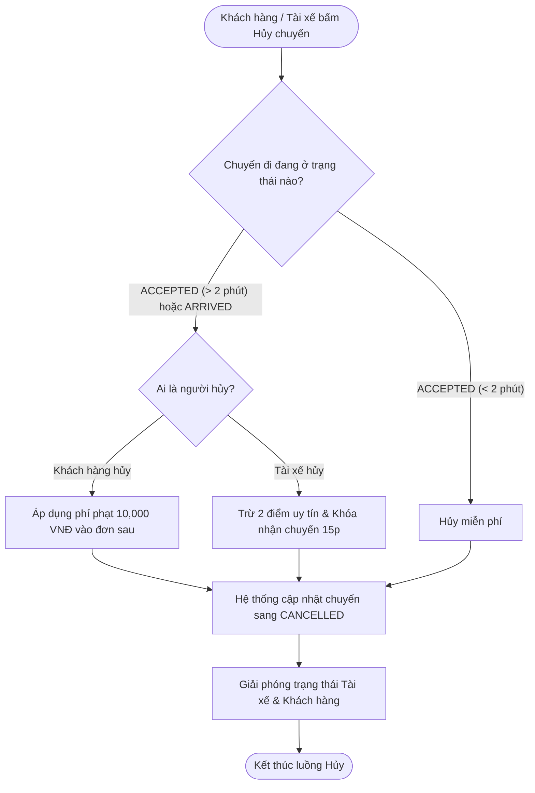
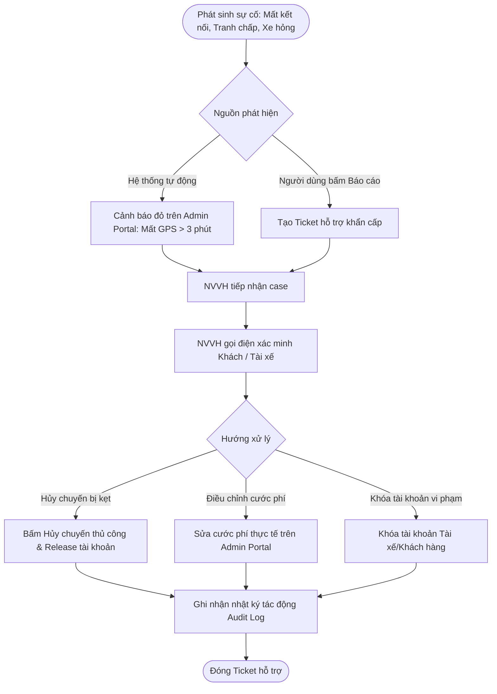
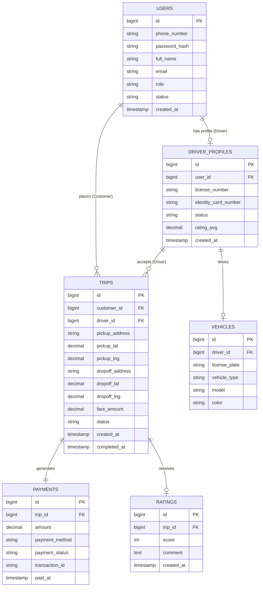
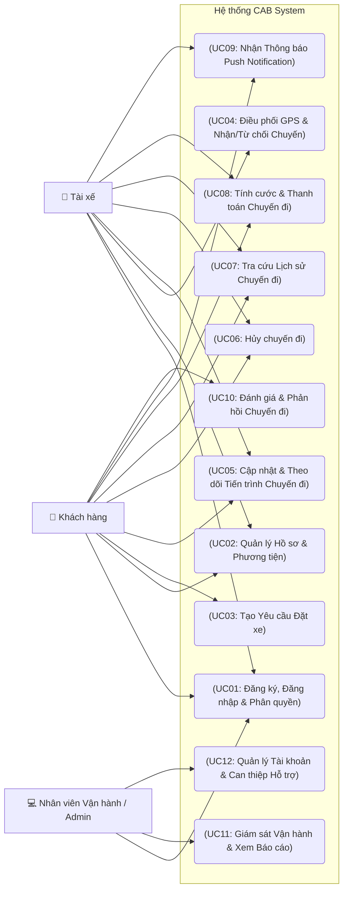

# Software Requirements Specification (SRS) - CAB System

## 1. Stakeholder List & Roles (Danh sách & Vai trò Bên liên quan)

| Stakeholder | Vai trò chính |
| :--- | :--- |
| **Ban Giám đốc** | Ra quyết định chiến lược, duyệt ngân sách và phê duyệt các quy tắc nghiệp vụ. |
| **Khách hàng** | Đặt xe, theo dõi chuyến đi, thanh toán và đánh giá chất lượng dịch vụ. |
| **Tài xế** | Bật trạng thái sẵn sàng, nhận/từ chối chuyến và cập nhật tiến trình chuyến đi. |
| **Nhân viên vận hành** | Theo dõi hệ thống, hỗ trợ xử lý sự cố chuyến đi và quản trị dữ liệu. |
| **Business Analyst** | Làm rõ yêu cầu chưa chốt và chi tiết hóa quy trình nghiệp vụ cho team. |
| **Nhóm Phát triển** | Thiết kế kiến trúc, lập trình và hoàn thiện hệ thống trong 7 tuần. |
| **Đối tác Thanh toán** | Tích hợp xử lý giao dịch điện tử. |
| **Đối tác Thông báo** | Thông báo tức thì đến người dùng. |

---

## 2. Stakeholder Matrix (Ma trận Bên liên quan)

---

## 3. Business Goals (Mục tiêu Kinh doanh)

| ID | Tên Mục tiêu | Mô tả Chi tiết |
| :--- | :--- | :--- |
| **BG01** | Tự động hóa & Mở rộng Vận hành | Tự động hóa quy trình phân công tài xế và tối ưu hóa vận hành nhằm giảm thiểu sự can thiệp thủ công, sẵn sàng mở rộng quy mô hệ thống phục vụ lượng lớn khách hàng và tài xế trong tương lai. |
| **BG02** | Tối ưu Doanh thu & Chuyến đi | Nâng cao doanh thu, tỷ lệ hoàn thành chuyến đi và giảm tỷ lệ hủy chuyến thông qua việc tối ưu cơ chế đề xuất, ghép nối tài xế gần nhất theo thời gian thực. |
| **BG03** | Nâng cao Trải nghiệm Khách hàng | Tăng cường trải nghiệm và độ hài lòng của khách hàng bằng việc minh bạch hóa thông tin trạng thái chuyến đi, vị trí tài xế, thời gian dự kiến đến và đa dạng hóa phương thức thanh toán an toàn. |
| **BG04** | Tối ưu Hiệu quả cho Tài xế | Tăng hiệu quả hoạt động và thu nhập cho tài xế nhờ cơ chế thông báo nhận chuyến chủ động, minh bạch tiến trình chuyến đi và quy trình hỗ trợ vận hành rõ ràng. |
| **BG05** | Nâng cao Năng lực Quản trị | Nâng cao năng lực quản trị, hỗ trợ và xử lý sự cố kịp thời thông qua hệ thống theo dõi trực quan, phân quyền chặt chẽ và công cụ báo cáo hoạt động chuyên sâu. |
| **BG06** | Kiến trúc Nền tảng Linh hoạt | Xây dựng kiến trúc nền tảng ổn định, bảo mật cao, có khả năng mở rộng độc lập và linh hoạt tích hợp/bổ sung các loại hình dịch vụ, đối tác thanh toán hay thông báo mới trong tương lai mà không ảnh hưởng tới hệ thống đang chạy. |
---

## 4. Minimum Viable Product (MVP) Modules

| ID | Tên Module | Mô tả Chức năng chính |
| :--- | :--- | :--- |
| **MOD01** | Quản lý Tài khoản & Định danh (*Account & Auth Module*) | Đăng ký, đăng nhập, quản lý hồ sơ (Khách hàng, Tài xế) và phân quyền quản trị (Nhân viên vận hành). |
| **MOD02** | Đặt xe & Phân công (*Booking & Matching Module*) | Tạo chuyến, định vị thời gian thực, thuật toán tự động ghép nối/tìm tài xế gần nhất và xử lý chuyển tiếp khi từ chối. |
| **MOD03** | Quản lý Tiến trình Chuyến đi (*Trip Management Module*) | Cập nhật/theo dõi trạng thái chuyến đi theo thời gian thực (ETA, vị trí), lịch sử chuyến và đánh giá tài xế. |
| **MOD04** | Tính cước & Thanh toán (*Pricing & Payment Module*) | Tính tiền tự động, hỗ trợ tiền mặt và tích hợp Payment Gateway bên ngoài xử lý thanh toán điện tử. |
| **MOD05** | Thông báo (*Notification Module*) | Gửi thông báo tức thì cho Khách hàng/Tài xế theo từng sự kiện của chuyến đi. |
| **MOD06** | Vận hành & Báo cáo (*Admin & Analytics Module*) | Giao diện quản trị theo dõi chuyến đi, hỗ trợ xử lý sự cố và xuất báo cáo doanh thu, hiệu suất cho Ban giám đốc. |
---

## 5. Business Requirements (Yêu cầu Nghiệp vụ)

| ID | Tên Yêu cầu | Mô tả Chi tiết |
| :--- | :--- | :--- |
| **BR01** | Quản lý Tài khoản & Phân quyền | Hệ thống hỗ trợ đăng ký, đăng nhập, cập nhật thông tin cá nhân và lịch sử hoạt động cho Khách hàng, Tài xế; đồng thời phân quyền truy cập chặt chẽ cho Nhân viên vận hành. |
| **BR02** | Đặt xe & Đề xuất Điều phối | Cho phép Khách hàng chọn dịch vụ, nhập điểm đón/đến và gửi yêu cầu; hệ thống ghi nhận vị trí GPS thời gian thực của Tài xế để tự động tìm kiếm, đề xuất và xử lý nhận/từ chối chuyến. |
| **BR03** | Quản lý Tiến trình Chuyến đi | Cho phép Tài xế cập nhật liên tục các trạng thái chuyến đi (*Đã đến điểm đón, Đã đón khách, Đang di chuyển, Hoàn thành*). |
| **BR04** | Tính cước & Thanh toán | Tự động tính cước sau khi hoàn thành chuyến đi; hỗ trợ thanh toán tiền mặt và tích hợp thanh toán điện tử an toàn qua Payment Gateway bên ngoài. |
| **BR05** | Giám sát & Hỗ trợ Vận hành | Cung cấp giao diện quản trị cho Nhân viên vận hành theo dõi danh sách chuyến đi đang diễn ra, trạng thái Tài xế, tra cứu lịch sử và can thiệp xử lý sự cố. |
| **BR06** | Báo cáo & Đánh giá Dịch vụ | Cung cấp báo cáo thống kê (doanh thu, số chuyến, tỷ lệ hủy, hiệu suất tài xế) cho Ban Giám đốc và cho phép Khách hàng đánh giá (rating/comment) chất lượng phục vụ. |

---
## 6. Business Process Modeling (Mô hình hóa Quy trình Nghiệp vụ)

### 6.1. Biểu đồ Tổng quan Toàn bộ Quy trình Nghiệp vụ (Overall Process Map)

### 6.2. Luồng Đặt xe & Điều phối Tự động (Core Booking & Matching)

### 6.3. Luồng Thực hiện Chuyến đi & Thanh toán (Trip Execution & Payment)

### 6.4. Quy trình Đăng ký & Xét duyệt Tài xế (Driver Onboarding)

### 6.5. Quy trình Hủy chuyến đi (Trip Cancellation)

### 6.6. Quy trình Can thiệp & Hỗ trợ Vận hành (Ops Intervention & Support)

---
## 7. Functional Requirements (Yêu cầu Chức năng)

### 7.1. MOD01 - Module Quản lý Tài khoản & Định danh (Account & Auth)

| ID | Tên Chức năng | Đối tượng | Mô tả Chi tiết | Yêu cầu Nghiệp vụ |
| :--- | :--- | :--- | :--- | :--- |
| **FR01.1** | Đăng ký, Đăng nhập & Phân quyền | KH, TX, NVVH | Cho phép người dùng đăng ký, đăng nhập bằng SĐT/OTP hoặc Email/Mật khẩu; tự động phân quyền theo vai trò (Customer, Driver, Admin). | BR01 |
| **FR01.2** | Quản lý Hồ sơ & Phương tiện | KH, TX | Khách hàng và Tài xế xem/cập nhật thông tin cá nhân; Tài xế tải lên giấy tờ xe, bằng lái và biển số xe để xét duyệt. | BR01 |

---

### 7.2. MOD02 - Module Đặt xe & Điều phối (Booking & Matching)

| ID | Tên Chức năng | Đối tượng | Mô tả Chi tiết | Yêu cầu Nghiệp vụ |
| :--- | :--- | :--- | :--- | :--- |
| **FR02.1** | Tạo Yêu cầu Đặt xe | KH | Cho phép Khách hàng chọn điểm đón/điểm đến trên bản đồ, xem trước giá cước, chọn loại dịch vụ và tạo chuyến đi. | BR02 |
| **FR02.2** | Định vị GPS & Điều phối Chuyến | Hệ thống, TX | Tự động quét tìm Tài xế "Sẵn sàng" gần nhất; gửi thông báo kèm đếm ngược 15s để Tài xế bấm Chấp nhận/Từ chối hoặc tự động chuyển tiếp. | BR02 |

---

### 7.3. MOD03 - Module Quản lý Tiến trình Chuyến đi (Trip Management)

| ID | Tên Chức năng | Đối tượng | Mô tả Chi tiết | Yêu cầu Nghiệp vụ |
| :--- | :--- | :--- | :--- | :--- |
| **FR03.1** | Cập nhật & Theo dõi Chuyến đi | KH, TX | Tài xế cập nhật các mốc trạng thái (*Đã đến*, *Đang di chuyển*, *Hoàn thành*); Khách hàng theo dõi vị trí xe thời gian thực (Real-time) trên bản đồ. | BR03 |
| **FR03.2** | Hủy chuyến đi | KH, TX | Cho phép Khách hàng hoặc Tài xế hủy chuyến kèm chọn lý do theo chính sách và phí phạt nghiệp vụ. | BR03 |
| **FR03.3** | Lịch sử Chuyến đi | KH, TX | Cho phép tra cứu danh sách các chuyến đi đã thực hiện (thời gian, lộ trình, cước phí, trạng thái). | BR01, BR03 |

---

### 7.4. MOD04 - Module Tính cước & Thanh toán (Pricing & Payment)

| ID | Tên Chức năng | Đối tượng | Mô tả Chi tiết | Yêu cầu Nghiệp vụ |
| :--- | :--- | :--- | :--- | :--- |
| **FR04.1** | Tự động Tính cước & Thanh toán | KH, TX, Hệ thống | Tự động tính cước dựa trên khoảng cách và loại xe; hỗ trợ thanh toán bằng Tiền mặt (tài xế xác nhận) hoặc qua Cổng thanh toán điện tử. | BR04 |

---

### 7.5. MOD05 - Module Thông báo & Đánh giá (Notification & Feedback)

| ID | Tên Chức năng | Đối tượng | Mô tả Chi tiết | Yêu cầu Nghiệp vụ |
| :--- | :--- | :--- | :--- | :--- |
| **FR05.1** | Push Notification | KH, TX | Gửi thông báo đẩy (Push) thời gian thực tới App khi chuyến đi có thay đổi trạng thái hoặc nhận thông báo từ hệ thống. | BR02, BR03 |
| **FR05.2** | Đánh giá Chuyến đi | KH | Cho phép Khách hàng chấm điểm (1–5 sao) và gửi phản hồi/nhận xét về Tài xế sau khi hoàn tất chuyến đi. | BR06 |

---

### 7.6. MOD06 - Module Vận hành & Quản trị (Admin & Operations)

| ID | Tên Chức năng | Đối tượng | Mô tả Chi tiết | Yêu cầu Nghiệp vụ |
| :--- | :--- | :--- | :--- | :--- |
| **FR06.1** | Giám sát & Báo cáo Vận hành | NVVH, ADMIN | Màn hình trực quan theo dõi các chuyến đi đang diễn ra, thống kê số lượng chuyến đi và báo cáo doanh thu/chiết khấu cơ bản. | BR05, BR06 |
| **FR06.2** | Khóa/Mở tài khoản & Hỗ trợ | NVVH, ADMIN | Cho phép quản trị viên duyệt/khóa tài khoản tài xế, can thiệp hủy chuyến kẹt hoặc xử lý các sự cố phát sinh. | BR05 |

---
## 8. Business Rules & Exception Handling (Quy tắc Nghiệp vụ & Xử lý Ngoại lệ)

### 8.1. Business Rules (Quy tắc Nghiệp vụ)

| ID | Quy tắc Nghiệp vụ | Mô tả & Logic Áp dụng | Áp dụng cho |
| :--- | :--- | :--- | :--- |
| **BR-RL01** | **Thời gian Phản hồi Nhận chuyến** | Tài xế có tối đa **15 giây** để bấm "Chấp nhận" hoặc "Từ chối" từ khi nhận thông báo. Quá 15 giây không phản hồi, hệ thống coi như "Từ chối" (Timeout). | Booking & Matching |
| **BR-RL02** | **Bán kính & Số lượng Tìm kiếm** | Ưu tiên quét Tài xế trong bán kính **3km** gần nhất; nếu không có, mở rộng tối đa lên **5km** và đề xuất lần lượt cho tối đa **5 Tài xế** liên tiếp. | Booking & Matching |
| **BR-RL03** | **Chính sách Hủy chuyến & Phí phạt** | • **Khách hàng:** Hủy miễn phí trong vòng **2 phút** sau khi Tài xế nhận chuyến. Hủy sau 2 phút hoặc khi Tài xế đã tới điểm đón sẽ chịu phí phạt **10,000 VNĐ**. • **Tài xế:** Tự ý hủy chuyến mà không có lý do chính đáng sẽ bị trừ **2 điểm uy tín** và tạm khóa nhận chuyến trong **15 phút**. | Trip Management |
| **BR-RL04** | **Thời gian Chờ tại Điểm đón** | Tài xế có trách nhiệm đợi Khách hàng tối đa **5 phút** tại điểm đón. Sau 5 phút nếu không liên lạc được Khách, Tài xế có quyền hủy chuyến với lý do *"Khách không xuất hiện"*. | Trip Management |
| **BR-RL05** | **Tỷ lệ Chiết khấu & Đối soát** | Hệ thống thu phí hoa hồng cố định **15%** trên tổng giá trị cước phí mỗi chuyến đi hoàn thành. Dữ liệu đối soát được chốt tự động vào **23:59:59 hàng ngày**. | Pricing & Payment |

### 8.2. Exception Handling (Xử lý Ngoại lệ & Sự cố)

| ID | Kịch bản Ngoại lệ / Sự cố | Nguyên nhân Phát sinh | Phương án Xử lý Tự động & Vận hành |
| :--- | :--- | :--- | :--- |
| **BR-EX01** | **Không tìm thấy Tài xế (No Driver Found)** | Không có tài xế sẵn sàng trong bán kính 5km hoặc tất cả tài xế đề xuất đều từ chối/timeout. | Hệ thống hiển thị thông báo gửi Khách hàng: *"Hiện tại các tài xế đều đang bận, vui lòng thử lại sau ít phút"*, đồng thời gợi ý Khách hàng tăng/đổi loại xe hoặc chọn lại điểm đón. |
| **BR-EX02** | **Mất kết nối GPS / Mất mạng (Connection Lost)** | App Khách hàng hoặc Tài xế bị rớt mạng/mất tín hiệu GPS trong quá trình diễn ra chuyến đi. | • **App Tài xế:** Lưu vết tọa độ offline tạm thời trên thiết bị, tự động đồng bộ lại ngay khi có kết nối. • **Hệ thống:** Nếu mất kết nối > 3 phút, gửi cảnh báo tới màn hình Vận hành (Admin) để NVVH chủ động gọi điện xác minh. |
| **BR-EX03** | **Thanh toán Điện tử Lỗi (Payment Failure)** | Cổng thanh toán bị timeout, tài khoản Khách hàng không đủ số dư hoặc giao dịch ngân hàng bị chối bỏ. | Hệ thống chuyển trạng thái thanh toán sang *"Thất bại"*, gửi Push Notification yêu cầu Khách hàng chọn phương thức thanh toán thay đổi (Chuyển sang Tiền mặt / Ví khác) để hoàn tất chuyến đi. |
| **BR-EX04** | **Tranh chấp Cước phí / Sự cố Đường dài** | Xe gặp sự cố kỹ thuật (hỏng xe, va chạm) giữa đường hoặc Lộ trình di chuyển thực tế lệch quá **20%** so với dự kiến. | Tài xế hoặc Khách hàng bấm nút *"Báo cáo Sự cố"* trên App. Hệ thống tạm dừng tính cước tự động, đóng băng giao dịch và chuyển chuyến đi sang trạng thái *"Chờ NVVH xử lý thủ công"*. |

---
## 9. Non-Functional Requirements (Yêu cầu Phi chức năng)

| ID | Nhóm Yêu cầu | Tiêu chí & Thông số Kỹ thuật |
| :--- | :--- | :--- |
| **NFR01** | **Hiệu năng (Performance)** | • Thời gian phản hồi API < **200ms** cho 95% các tác vụ thông thường. • Thời gian tìm kiếm và đề xuất tài xế gần nhất < **2 giây**. • Độ trễ cập nhật vị trí GPS real-time trên bản đồ từ **3 - 5 giây**. |
| **NFR02** | **Bảo mật (Security)** | • Mã hóa toàn bộ dữ liệu truyền tải qua **HTTPS/TLS 1.3**. • Xác thực và phân quyền truy cập thông qua **JWT (JSON Web Token)** & OAuth 2.0. • Mã hóa mật khẩu người dùng bằng thuật toán bcrypt/Argon2. • Tuân thủ tiêu chuẩn PCI-DSS (không lưu trữ thông tin thẻ thanh toán nhạy cảm trên hệ thống CAB). |
| **NFR03** | **Độ tin cậy & Khả dụng (Availability)** | • Thời gian hoạt động của hệ thống (Uptime) đạt tối thiểu **99.9%** (24/7/365). • Tự động sao lưu (Backup) cơ sở dữ liệu định kỳ 1 lần/ngày và lưu trữ tối thiểu 30 ngày. |
| **NFR04** | **Khả năng mở rộng (Scalability)** | • Kiến trúc Microservices/Modular Monolith hỗ trợ mở rộng chiều ngang (Horizontal Scaling). • Đáp ứng tối thiểu **10,000 người dùng hoạt động đồng thời (DAU)** và xử lý **1,000 chuyến đi/phút** trong giờ cao điểm mà không gây gián đoạn. |
| **NFR05** | **Tính Dễ sử dụng (Usability)** | • Giao diện di động tối ưu cho thao tác 1 tay, thân thiện trên cả 2 nền tảng iOS và Android. • Hiển thị thông báo trạng thái rõ ràng, hỗ trợ ngôn ngữ Tiếng Việt và Tiếng Anh. |

---

## 10. Data modeling 
**Mô hình Dữ liệu ERD**

---

## 11. Use Cases 
*** Use Case Diagram

---
## 12. Acceptance Criteria (Tiêu chí Chấp nhận - AC)

**Bảng Tiêu chí Chấp nhận theo Module**

| Mã FR | Tên Chức năng | Mã AC | Given (Điều kiện tiên quyết) | When (Hành động kích hoạt) | Then (Kết quả kỳ vọng) |
| :--- | :--- | :--- | :--- | :--- | :--- |
| **FR01.1** | Đăng ký, Đăng nhập & Phân quyền | **AC-FR01.1a** | Người dùng nhập SĐT chính xác trên giao diện Đăng ký/Đăng nhập. | Nhấn nút "Gửi mã OTP". | Hệ thống gửi mã OTP xác thực qua SMS/Notification thành công trong vòng 5 giây. |
| | | **AC-FR01.1b** | Mã OTP đã được gửi đến thiết bị người dùng. | Người dùng nhập mã OTP hợp lệ và nhấn "Xác nhận". | Hệ thống xác thực thành công, trả về JWT Token và đăng nhập người dùng vào đúng giao diện theo Role (Customer/Driver/Admin). |
| **FR01.2** | Quản lý Hồ sơ & Phương tiện | **AC-FR01.2a** | Khách hàng/Tài xế đã đăng nhập và mở trang Thông tin cá nhân. | Thay đổi thông tin (Họ tên, Email, Avatar) và nhấn "Lưu thay đổi". | Dữ liệu hồ sơ trong DB được cập nhật thành công và hiển thị ngay trên giao diện. |
| | | **AC-FR01.2b** | Tài xế đăng tải đầy đủ hình ảnh Bằng lái, Giấy tờ xe và Biển số xe. | Tài xế nhấn "Gửi hồ sơ xét duyệt". | Trạng thái tài khoản chuyển thành `PENDING_APPROVAL`; tài xế chưa thể bật trạng thái Sẵn sàng cho đến khi Admin phê duyệt. |
| **FR02.1** | Tạo Yêu cầu Đặt xe | **AC-FR02.1** | Khách hàng chọn xong Điểm đón, Điểm đến và loại phương tiện. | Khách hàng nhấn nút "Đặt xe". | Hệ thống tạo chuyến đi ở trạng thái `PENDING`, hiển thị đúng bản đồ lộ trình và cước phí tạm tính. |
| **FR02.2** | Định vị GPS & Điều phối Chuyến | **AC-FR02.2a** | Có chuyến đi mới ở trạng thái `PENDING`. | Thuật toán điều phối của hệ thống được kích hoạt. | Hệ thống quét bán kính 3km (mở rộng tối đa 5km) và gửi thông báo nhận chuyến kèm đếm ngược 15s tới Tài xế Sẵn sàng gần nhất. |
| | | **AC-FR02.2b** | Tài xế nhận đề xuất chuyến đi nhưng không bấm chọn hoặc từ chối sau 15s. | Đồng hồ đếm ngược chạm mốc 0s hoặc Tài xế bấm "Từ chối". | Hệ thống tự động chuyển tiếp yêu cầu đặt xe tới tài xế phù hợp tiếp theo trong danh sách. |
| **FR03.1** | Cập nhật & Theo dõi Chuyến đi | **AC-FR03.1a** | Tài xế đã chấp nhận chuyến đi (`ACCEPTED`). | Tài xế nhấn lần lượt các nút trạng thái trên App. | Trạng thái chuyến đi trong hệ thống cập nhật đúng tiến trình: `ARRIVED` (Đã đến) $\rightarrow$ `IN_PROGRESS` (Đã đón/Đang di chuyển) $\rightarrow$ `COMPLETED` (Hoàn thành). |
| | | **AC-FR03.1b** | Chuyến đi đang ở trạng thái `IN_PROGRESS`. | App Tài xế truyền dữ liệu GPS định kỳ mỗi 3–5 giây. | Giao diện Khách hàng hiển thị chính xác vị trí tài xế di chuyển mượt mà trên bản đồ kèm ETA cập nhật liên tục. |
| **FR03.2** | Hủy chuyến đi | **AC-FR03.2** | Chuyến đi ở trạng thái `PENDING` hoặc `ACCEPTED`. | Khách hàng hoặc Tài xế nhấn "Hủy chuyến" và chọn lý do hủy. | Chuyến đi chuyển trạng thái `CANCELLED`, giải phóng trạng thái sẵn sàng cho các bên và áp dụng chính sách phí phạt hủy chuyến (nếu có). |
| **FR03.3** | Lịch sử Chuyến đi | **AC-FR03.3** | Người dùng truy cập tab "Lịch sử chuyến đi". | Chọn một chuyến đi bất kỳ trong danh sách. | Màn hình hiển thị đầy đủ thông tin: Mã chuyến, Điểm đón/trả, Ngày giờ, Giá tiền, Phương thức thanh toán và Trạng thái chuyến. |
| **FR04.1** | Tự động Tính cước & Thanh toán | **AC-FR04.1a** | Tài xế nhấn "Hoàn thành chuyến đi" tại điểm đến. | Hệ thống chốt quãng đường di chuyển thực tế. | Tổng cước phí được tự động tính toán chính xác theo công thức và hiển thị lên màn hình của cả Khách hàng và Tài xế. |
| | | **AC-FR04.1b** | Khách hàng chọn thanh toán Tiền mặt hoặc Thanh toán qua Cổng điện tử. | Tài xế xác nhận nhận tiền mặt HOẶC Cổng thanh toán trả kết quả giao dịch thành công. | Trạng thái thanh toán chuyển thành `PAID`, hệ thống trích xuất % chiết khấu tài xế và gửi hóa đơn điện tử cho khách hàng. |
| **FR05.1** | Push Notification | **AC-FR05.1** | Trạng thái chuyến đi có sự thay đổi (đã nhận chuyến, đã đến, hoàn thành, hủy chuyến). | Sự kiện thay đổi trạng thái phát sinh trên server. | Thiết bị của Khách hàng/Tài xế nhận được Push Notification tương ứng tức thì với độ trễ dưới 2 giây. |
| **FR05.2** | Đánh giá Chuyến đi | **AC-FR05.2** | Chuyến đi hoàn thành (`COMPLETED`) và khách hàng mở màn hình Đánh giá. | Khách hàng chọn số sao (1-5) và nhập nhận xét rồi bấm "Gửi". | Điểm đánh giá được ghi nhận vào DB, tính lại điểm `rating_avg` cho Tài xế; nếu đánh giá $\le$ 2 sao, hệ thống tự động tạo cảnh báo hỗ trợ. |
| **FR06.1** | Giám sát & Báo cáo Vận hành | **AC-FR06.1a** | NVVH mở màn hình "Giám sát Vận hành" trên Admin Portal. | Đăng nhập hệ thống quản trị. | Bản đồ hiển thị toàn bộ các chuyến đi đang diễn ra theo thời gian thực và tự động cảnh báo đỏ đối với các chuyến mất GPS trên 3 phút. |
| | | **AC-FR06.1b** | Admin chọn khoảng thời gian báo cáo và bấm "Xuất báo cáo". | Yêu cầu kết xuất báo cáo được gửi. | Hệ thống tạo và tải xuống file (Excel/PDF) thống kê chi tiết tổng doanh thu, số lượng chuyến đi, tỷ lệ hủy và chiết khấu. |
| **FR06.2** | Khóa/Mở tài khoản & Hỗ trợ | **AC-FR06.2** | Quản trị viên chọn một tài khoản tài xế vi phạm hoặc một chuyến đi đang gặp sự cố/kẹt. | Thực hiện hành động "Khóa tài khoản" hoặc "Hủy chuyến thủ công" kèm nhập lý do. | Trạng thái tài khoản/chuyến đi được cập nhật lập tức, thông báo gửi tới người dùng và toàn bộ thao tác được lưu vết vào Audit Log. |
---

## 13. Traceability Matrix (Bảng Truy vết Nghiệp vụ & Kỹ thuật)

Bảng truy vết đảm bảo tính khép kín và nhất quán từ Mục tiêu Kinh doanh (BG) cho đến Tiêu chí Nghiệm thu (AC):

| Mã BG | Mã BR | Mã BPM (Quy trình) | Mã FR | Mã UC | Mã AC |
| :--- | :--- | :--- | :--- | :--- | :--- |
| **BG01** | **BR01** | **BPM6.4** (Onboarding) | **FR01.1** | UC01 | **AC-FR01.1a, AC-FR01.1b** |
| | **BR02** | **BPM6.1** (Đặt xe & Điều phối) | **FR02.2** | UC04 | **AC-FR02.2a, AC-FR02.2b** |
| **BG02** | **BR02** | **BPM6.1** (Đặt xe & Điều phối) | **FR02.1** | UC03 | **AC-FR02.1** |
| | | **BPM6.1** (Đặt xe & Điều phối) | **FR02.2** | UC04 | **AC-FR02.2a, AC-FR02.2b** |
| | **BR03** | **BPM6.5** (Hủy chuyến) | **FR03.2** | UC06 | **AC-FR03.2** |
| **BG03** | **BR03** | **BPM6.2** (Thực hiện chuyến) | **FR03.1** | UC05 | **AC-FR03.1a, AC-FR03.1b** |
| | | **BPM6.2** (Thực hiện chuyến) | **FR03.3** | UC07 | **AC-FR03.3** |
| | **BR04** | **BPM6.2** (Thực hiện & Thanh toán) | **FR04.1** | UC08 | **AC-FR04.1a, AC-FR04.1b** |
| | **BR06** | **BPM6.2** (Thực hiện chuyến) | **FR05.2** | UC10 | **AC-FR05.2** |
| **BG04** | **BR01** | **BPM6.4** (Onboarding) | **FR01.2** | UC02 | **AC-FR01.2a, AC-FR01.2b** |
| | **BR02** | **BPM6.1** (Đặt xe & Điều phối) | **FR02.2** | UC04 | **AC-FR02.2a** |
| | **BR03** | **BPM6.2** (Thực hiện chuyến) | **FR03.1** | UC05 | **AC-FR03.1a** |
| | **BR04** | **BPM6.2** (Thực hiện & Thanh toán) | **FR04.1** | UC08 | **AC-FR04.1a, AC-FR04.1b** |
| **BG05** | **BR05** | **BPM6.6** (Can thiệp & Vận hành) | **FR06.1** | UC11 | **AC-FR06.1a** |
| | | **BPM6.6** (Can thiệp & Vận hành) | **FR06.2** | UC12 | **AC-FR06.2** |
| | **BR06** | **BPM6.6** (Đối soát & Báo cáo) | **FR06.1** | UC11 | **AC-FR06.1b** |
| **BG06** | **BR01** | **BPM6.4** (Onboarding) | **FR01.1** | UC01 | **AC-FR01.1a, AC-FR01.1b** |
| | **BR02, BR03** | **BPM6.1, BPM6.2** (Các luồng chính) | **FR05.1** | UC09 | **AC-FR05.1** |
