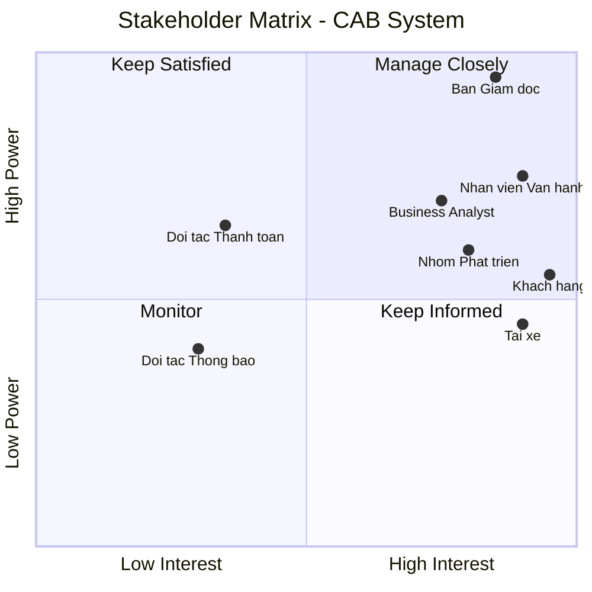
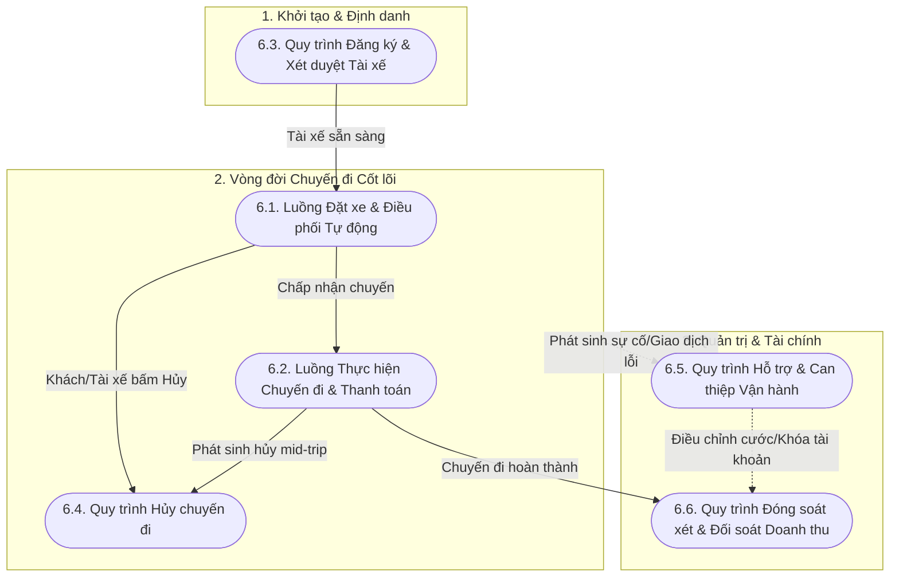
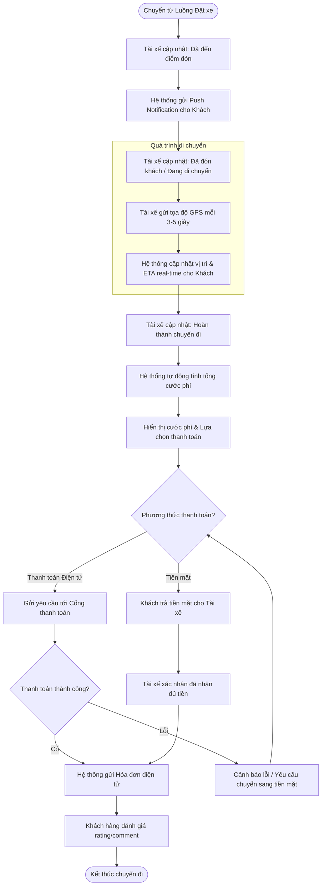
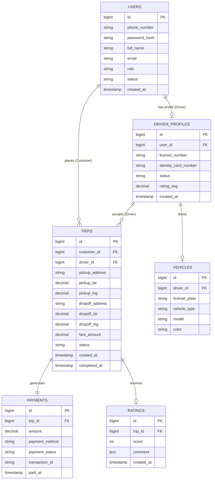
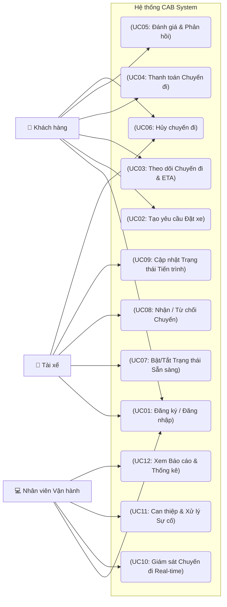

# Software Requirements Specification (SRS) - CAB System

## 1. Stakeholder List & Roles (Danh sách & Vai trò Bên liên quan)

| Stakeholder | Vai trò chính |
| :--- | :--- |
| **Ban Giám đốc** | Ra quyết định chiến lược, duyệt ngân sách và phê duyệt các quy tắc nghiệp vụ. |
| **Khách hàng** | Đặt xe, theo dõi chuyến đi, thanh toán và đánh giá chất lượng dịch vụ. |
| **Tài xế** | Bật trạng thái sẵn sàng, nhận/từ chối chuyến và cập nhật tiến trình chuyến đi. |
| **Nhân viên vận hành** | Theo dõi hệ thống, hỗ trợ xử lý sự cố chuyến đi và quản trị dữ liệu. |
| **Business Analyst** | Làm rõ yêu cầu chưa chốt và chi tiết hóa quy trình nghiệp vụ cho team. |
| **Nhóm Phát triển** | Thiết kế kiến trúc, lập trình và hoàn thiện hệ thống trong 7 tuần. |
| **Đối tác Thanh toán** | Tích hợp xử lý giao dịch điện tử. |
| **Đối tác Thông báo** | Thông báo tức thì đến người dùng. |

---

## 2. Stakeholder Matrix (Ma trận Bên liên quan)

---

## 3. Business Goals (Mục tiêu Kinh doanh)

| ID | Tên Mục tiêu | Mô tả Chi tiết |
| :--- | :--- | :--- |
| **BG01** | Tự động hóa & Mở rộng Vận hành | Tự động hóa quy trình phân công tài xế và tối ưu hóa vận hành nhằm giảm thiểu sự can thiệp thủ công, sẵn sàng mở rộng quy mô hệ thống phục vụ lượng lớn khách hàng và tài xế trong tương lai. |
| **BG02** | Tối ưu Doanh thu & Chuyến đi | Nâng cao doanh thu, tỷ lệ hoàn thành chuyến đi và giảm tỷ lệ hủy chuyến thông qua việc tối ưu cơ chế đề xuất, ghép nối tài xế gần nhất theo thời gian thực. |
| **BG03** | Nâng cao Trải nghiệm Khách hàng | Tăng cường trải nghiệm và độ hài lòng của khách hàng bằng việc minh bạch hóa thông tin trạng thái chuyến đi, vị trí tài xế, thời gian dự kiến đến và đa dạng hóa phương thức thanh toán an toàn. |
| **BG04** | Tối ưu Hiệu quả cho Tài xế | Tăng hiệu quả hoạt động và thu nhập cho tài xế nhờ cơ chế thông báo nhận chuyến chủ động, minh bạch tiến trình chuyến đi và quy trình hỗ trợ vận hành rõ ràng. |
| **BG05** | Nâng cao Năng lực Quản trị | Nâng cao năng lực quản trị, hỗ trợ và xử lý sự cố kịp thời thông qua hệ thống theo dõi trực quan, phân quyền chặt chẽ và công cụ báo cáo hoạt động chuyên sâu. |
| **BG06** | Kiến trúc Nền tảng Linh hoạt | Xây dựng kiến trúc nền tảng ổn định, bảo mật cao, có khả năng mở rộng độc lập và linh hoạt tích hợp/bổ sung các loại hình dịch vụ, đối tác thanh toán hay thông báo mới trong tương lai mà không ảnh hưởng tới hệ thống đang chạy. |
---

## 4. Minimum Viable Product (MVP) Modules

| ID | Tên Module | Mô tả Chức năng chính |
| :--- | :--- | :--- |
| **MOD01** | Quản lý Tài khoản & Định danh (*Account & Auth Module*) | Đăng ký, đăng nhập, quản lý hồ sơ (Khách hàng, Tài xế) và phân quyền quản trị (Nhân viên vận hành). |
| **MOD02** | Đặt xe & Phân công (*Booking & Matching Module*) | Tạo chuyến, định vị thời gian thực, thuật toán tự động ghép nối/tìm tài xế gần nhất và xử lý chuyển tiếp khi từ chối. |
| **MOD03** | Quản lý Tiến trình Chuyến đi (*Trip Management Module*) | Cập nhật/theo dõi trạng thái chuyến đi theo thời gian thực (ETA, vị trí), lịch sử chuyến và đánh giá tài xế. |
| **MOD04** | Tính cước & Thanh toán (*Pricing & Payment Module*) | Tính tiền tự động, hỗ trợ tiền mặt và tích hợp Payment Gateway bên ngoài xử lý thanh toán điện tử. |
| **MOD05** | Thông báo (*Notification Module*) | Gửi thông báo tức thì cho Khách hàng/Tài xế theo từng sự kiện của chuyến đi. |
| **MOD06** | Vận hành & Báo cáo (*Admin & Analytics Module*) | Giao diện quản trị theo dõi chuyến đi, hỗ trợ xử lý sự cố và xuất báo cáo doanh thu, hiệu suất cho Ban giám đốc. |
---

## 5. Business Requirements (Yêu cầu Nghiệp vụ)

| ID | Tên Yêu cầu | Mô tả Chi tiết |
| :--- | :--- | :--- |
| **BR01** | Quản lý Tài khoản & Phân quyền | Hệ thống hỗ trợ đăng ký, đăng nhập, cập nhật thông tin cá nhân và lịch sử hoạt động cho Khách hàng, Tài xế; đồng thời phân quyền truy cập chặt chẽ cho Nhân viên vận hành. |
| **BR02** | Đặt xe & Đề xuất Điều phối | Cho phép Khách hàng chọn dịch vụ, nhập điểm đón/đến và gửi yêu cầu; hệ thống ghi nhận vị trí GPS thời gian thực của Tài xế để tự động tìm kiếm, đề xuất và xử lý nhận/từ chối chuyến. |
| **BR03** | Quản lý Tiến trình Chuyến đi | Cho phép Tài xế cập nhật liên tục các trạng thái chuyến đi (*Đã đến điểm đón, Đã đón khách, Đang di chuyển, Hoàn thành*). |
| **BR04** | Tính cước & Thanh toán | Tự động tính cước sau khi hoàn thành chuyến đi; hỗ trợ thanh toán tiền mặt và tích hợp thanh toán điện tử an toàn qua Payment Gateway bên ngoài. |
| **BR05** | Giám sát & Hỗ trợ Vận hành | Cung cấp giao diện quản trị cho Nhân viên vận hành theo dõi danh sách chuyến đi đang diễn ra, trạng thái Tài xế, tra cứu lịch sử và can thiệp xử lý sự cố. |
| **BR06** | Báo cáo & Đánh giá Dịch vụ | Cung cấp báo cáo thống kê (doanh thu, số chuyến, tỷ lệ hủy, hiệu suất tài xế) cho Ban Giám đốc và cho phép Khách hàng đánh giá (rating/comment) chất lượng phục vụ. |

---
## 6. Business Process Modeling (Mô hình hóa Quy trình Nghiệp vụ)

### 6.1. Biểu đồ Tổng quan Toàn bộ Quy trình Nghiệp vụ (Overall Process Map)

### 6.2. Luồng Đặt xe & Điều phối Tự động (Core Booking & Matching)

### 6.3. Luồng Thực hiện Chuyến đi & Thanh toán (Trip Execution & Payment)

### 6.4. Quy trình Đăng ký & Xét duyệt Tài xế (Driver Onboarding)

### 6.5. Quy trình Hủy chuyến đi (Trip Cancellation)

### 6.6. Quy trình Can thiệp & Hỗ trợ Vận hành (Ops Intervention & Support)

---
## 7. Functional Requirements (Yêu cầu Chức năng)

Dưới đây là danh sách chi tiết các Yêu cầu Chức năng (FR) được phân chia theo 6 Module MVP của hệ thống CAB System.

### 7.1. MOD01 - Module Quản lý Tài khoản & Định danh (Account & Auth)

| ID | Tên Chức năng | Đối tượng | Mô tả Chi tiết | Yêu cầu Nghiệp vụ |
| :--- | :--- | :--- | :--- | :--- |
| **FR01.1** | Đăng ký & Đăng nhập | KH, TX | Cho phép người dùng đăng ký, đăng nhập bằng Số điện thoại/OTP hoặc Email/Mật khẩu. | BR01 |
| **FR01.2** | Quản lý Hồ sơ Cá nhân | KH, TX | Cho phép xem và cập nhật thông tin cá nhân (Họ tên, Ảnh đại diện, Email, Số điện thoại). | BR01 |
| **FR01.3** | Quản lý Hồ sơ Phương tiện | TX | Cho phép Tài xế tải lên và cập nhật giấy tờ xe, bằng lái, biển số xe và loại xe. | BR01 |
| **FR01.4** | Phân quyền Truy cập (RBAC) | NVVH, ADMIN | Áp dụng phân quyền chặt chẽ theo vai trò (Role-based Access Control) cho Nhân viên vận hành và Admin. | BR01 |  

### 7.2. MOD02 - Module Đặt xe & Phân công (Booking & Matching)

| ID | Tên Chức năng | Đối tượng | Mô tả Chi tiết | Yêu cầu Nghiệp vụ |
| :--- | :--- | :--- | :--- | :--- |
| **FR02.1** | Tạo Yêu cầu Đặt xe | KH | Cho phép Khách hàng chọn điểm đón/điểm đến trên bản đồ, chọn loại dịch vụ và tạo chuyến đi. | BR02 |
| **FR02.2** | Định vị GPS & Tìm xe | Hệ thống | Tự động xác định tọa độ GPS, tìm kiếm và đề xuất các Tài xế đang ở trạng thái "Sẵn sàng" gần nhất. | BR02 |
| **FR02.3** | Nhận / Từ chối Chuyến | TX | Gửi thông báo nhận chuyến tới Tài xế với đếm ngược thời gian; cho phép Tài xế bấm Chấp nhận hoặc Từ chối. | BR02 |
| **FR02.4** | Tự động Chuyển tiếp | Hệ thống | Tự động điều phối yêu cầu sang Tài xế tiếp theo nếu Tài xế trước từ chối hoặc hết thời gian phản hồi (Timeout). | BR02 |

### 7.3. MOD03 - Module Quản lý Tiến trình Chuyến đi (Trip Management)

| ID | Tên Chức năng | Đối tượng | Mô tả Chi tiết | Yêu cầu Nghiệp vụ |
| :--- | :--- | :--- | :--- | :--- |
| **FR03.1** | Cập nhật Trạng thái | TX | Cho phép Tài xế chuyển đổi các mốc trạng thái chuyến đi (*Đã đến điểm đón*, *Đã đón khách*, *Đang di chuyển*, *Hoàn thành*). | BR03 |
| **FR03.2** | Theo dõi Real-time & ETA | KH | Hiển thị vị trí thực của Tài xế di chuyển trên bản đồ và cập nhật thời gian dự kiến đến (ETA) liên tục. | BR03 |
| **FR03.3** | Hủy chuyến đi | KH, TX | Cho phép Khách hàng hoặc Tài xế gửi yêu cầu hủy chuyến đi kèm lý do cụ thể theo quy tắc nghiệp vụ. | BR03 |
| **FR03.4** | Lịch sử Chuyến đi | KH, TX | Cho phép tra cứu danh sách các chuyến đi đã thực hiện (thời gian, lộ trình, cước phí, trạng thái). | BR01, BR03 |

### 7.4. MOD04 - Module Tính cước & Thanh toán (Pricing & Payment)

| ID | Tên Chức năng | Đối tượng | Mô tả Chi tiết | Yêu cầu Nghiệp vụ |
| :--- | :--- | :--- | :--- | :--- |
| **FR04.1** | Tự động Tính cước | Hệ thống | Tính toán tổng tiền chuyến đi dựa trên khoảng cách, thời gian di chuyển, loại dịch vụ và phụ phí (nếu có). | BR04 |
| **FR04.2** | Thanh toán Tiền mặt | KH, TX | Cho phép Khách hàng trả tiền mặt trực tiếp và Tài xế bấm xác nhận đã nhận đủ tiền trên app. | BR04 |
| **FR04.3** | Thanh toán Điện tử | KH, Hệ thống | Tích hợp Cổng thanh toán (Payment Gateway) cho phép Khách hàng thanh toán qua Ví điện tử/Thẻ/Banking. | BR04 |
| **FR04.4** | Xuất Hóa đơn Điện tử | Hệ thống | Tự động tạo và gửi hóa đơn/biên nhận thanh toán điện tử cho Khách hàng qua ứng dụng hoặc Email. | BR04 |

### 7.5. MOD05 - Module Thông báo (Notification)

| ID | Tên Chức năng | Đối tượng | Mô tả Chi tiết | Yêu cầu Nghiệp vụ |
| :--- | :--- | :--- | :--- | :--- |
| **FR05.1** | Inform Push Notification | KH, TX | Gửi thông báo đẩy (Push) tức thì theo thời gian thực tới app khi trạng thái chuyến đi thay đổi. | BR02, BR03 |
| **FR05.2** | Thông báo SMS Backup | KH | Gửi mã OTP đăng nhập hoặc thông báo quan trọng qua SMS trong trường hợp không nhận được Push. | BR01, BR03 |

### 7.6. MOD06 - Module Vận hành & Báo cáo (Admin & Analytics)

| ID | Tên Chức năng | Đối tượng | Mô tả Chi tiết | Yêu cầu Nghiệp vụ |
| :--- | :--- | :--- | :--- | :--- |
| **FR06.1** | Giám sát Chuyến đi Real-time| NVVH | Cung cấp màn hình bản đồ trực quan theo dõi toàn bộ các chuyến đi đang diễn ra và vị trí các Tài xế. | BR05 |
| **FR06.2** | Can thiệp & Hỗ trợ Vận hành| NVVH | Cho phép Nhân viên vận hành hủy chuyến kẹt, gán lại tài xế, điều chỉnh cước phí lỗi hoặc khóa tài khoản vi phạm. | BR05 |
| **FR06.3** | Báo cáo Thống kê Doanh thu | ADMIN, BGD | Xuất báo cáo tổng quan/chi tiết về doanh thu, số lượng chuyến, tỷ lệ hoàn thành/hủy và chiết khấu theo ngày/tần/tháng. | BR06 |
| **FR06.4** | Quản lý Đánh giá & Phản hồi | NVVH, ADMIN | Quản lý rating/comment của Khách hàng về Tài xế để xử lý khiếu nại và nâng cao chất lượng dịch vụ. | BR06 |

---
## 8. Business Rules & Exception Handling (Quy tắc Nghiệp vụ & Xử lý Ngoại lệ)

### 8.1. Business Rules (Quy tắc Nghiệp vụ)

| ID | Quy tắc Nghiệp vụ | Mô tả & Logic Áp dụng | Áp dụng cho |
| :--- | :--- | :--- | :--- |
| **BR-RL01** | **Thời gian Phản hồi Nhận chuyến** | Tài xế có tối đa **15 giây** để bấm "Chấp nhận" hoặc "Từ chối" từ khi nhận thông báo. Quá 15 giây không phản hồi, hệ thống coi như "Từ chối" (Timeout). | Booking & Matching |
| **BR-RL02** | **Bán kính & Số lượng Tìm kiếm** | Ưu tiên quét Tài xế trong bán kính **3km** gần nhất; nếu không có, mở rộng tối đa lên **5km** và đề xuất lần lượt cho tối đa **5 Tài xế** liên tiếp. | Booking & Matching |
| **BR-RL03** | **Chính sách Hủy chuyến & Phí phạt** | • **Khách hàng:** Hủy miễn phí trong vòng **2 phút** sau khi Tài xế nhận chuyến. Hủy sau 2 phút hoặc khi Tài xế đã tới điểm đón sẽ chịu phí phạt **10,000 VNĐ**. • **Tài xế:** Tự ý hủy chuyến mà không có lý do chính đáng sẽ bị trừ **2 điểm uy tín** và tạm khóa nhận chuyến trong **15 phút**. | Trip Management |
| **BR-RL04** | **Thời gian Chờ tại Điểm đón** | Tài xế có trách nhiệm đợi Khách hàng tối đa **5 phút** tại điểm đón. Sau 5 phút nếu không liên lạc được Khách, Tài xế có quyền hủy chuyến với lý do *"Khách không xuất hiện"*. | Trip Management |
| **BR-RL05** | **Tỷ lệ Chiết khấu & Đối soát** | Hệ thống thu phí hoa hồng cố định **15%** trên tổng giá trị cước phí mỗi chuyến đi hoàn thành. Dữ liệu đối soát được chốt tự động vào **23:59:59 hàng ngày**. | Pricing & Payment |

### 8.2. Exception Handling (Xử lý Ngoại lệ & Sự cố)

| ID | Kịch bản Ngoại lệ / Sự cố | Nguyên nhân Phát sinh | Phương án Xử lý Tự động & Vận hành |
| :--- | :--- | :--- | :--- |
| **BR-EX01** | **Không tìm thấy Tài xế (No Driver Found)** | Không có tài xế sẵn sàng trong bán kính 5km hoặc tất cả tài xế đề xuất đều từ chối/timeout. | Hệ thống hiển thị thông báo gửi Khách hàng: *"Hiện tại các tài xế đều đang bận, vui lòng thử lại sau ít phút"*, đồng thời gợi ý Khách hàng tăng/đổi loại xe hoặc chọn lại điểm đón. |
| **BR-EX02** | **Mất kết nối GPS / Mất mạng (Connection Lost)** | App Khách hàng hoặc Tài xế bị rớt mạng/mất tín hiệu GPS trong quá trình diễn ra chuyến đi. | • **App Tài xế:** Lưu vết tọa độ offline tạm thời trên thiết bị, tự động đồng bộ lại ngay khi có kết nối. • **Hệ thống:** Nếu mất kết nối > 3 phút, gửi cảnh báo tới màn hình Vận hành (Admin) để NVVH chủ động gọi điện xác minh. |
| **BR-EX03** | **Thanh toán Điện tử Lỗi (Payment Failure)** | Cổng thanh toán bị timeout, tài khoản Khách hàng không đủ số dư hoặc giao dịch ngân hàng bị chối bỏ. | Hệ thống chuyển trạng thái thanh toán sang *"Thất bại"*, gửi Push Notification yêu cầu Khách hàng chọn phương thức thanh toán thay đổi (Chuyển sang Tiền mặt / Ví khác) để hoàn tất chuyến đi. |
| **BR-EX04** | **Tranh chấp Cước phí / Sự cố Đường dài** | Xe gặp sự cố kỹ thuật (hỏng xe, va chạm) giữa đường hoặc Lộ trình di chuyển thực tế lệch quá **20%** so với dự kiến. | Tài xế hoặc Khách hàng bấm nút *"Báo cáo Sự cố"* trên App. Hệ thống tạm dừng tính cước tự động, đóng băng giao dịch và chuyển chuyến đi sang trạng thái *"Chờ NVVH xử lý thủ công"*. |

---
## 9. Non-Functional Requirements (Yêu cầu Phi chức năng)

| ID | Nhóm Yêu cầu | Tiêu chí & Thông số Kỹ thuật |
| :--- | :--- | :--- |
| **NFR01** | **Hiệu năng (Performance)** | • Thời gian phản hồi API < **200ms** cho 95% các tác vụ thông thường. • Thời gian tìm kiếm và đề xuất tài xế gần nhất < **2 giây**. • Độ trễ cập nhật vị trí GPS real-time trên bản đồ từ **3 - 5 giây**. |
| **NFR02** | **Bảo mật (Security)** | • Mã hóa toàn bộ dữ liệu truyền tải qua **HTTPS/TLS 1.3**. • Xác thực và phân quyền truy cập thông qua **JWT (JSON Web Token)** & OAuth 2.0. • Mã hóa mật khẩu người dùng bằng thuật toán bcrypt/Argon2. • Tuân thủ tiêu chuẩn PCI-DSS (không lưu trữ thông tin thẻ thanh toán nhạy cảm trên hệ thống CAB). |
| **NFR03** | **Độ tin cậy & Khả dụng (Availability)** | • Thời gian hoạt động của hệ thống (Uptime) đạt tối thiểu **99.9%** (24/7/365). • Tự động sao lưu (Backup) cơ sở dữ liệu định kỳ 1 lần/ngày và lưu trữ tối thiểu 30 ngày. |
| **NFR04** | **Khả năng mở rộng (Scalability)** | • Kiến trúc Microservices/Modular Monolith hỗ trợ mở rộng chiều ngang (Horizontal Scaling). • Đáp ứng tối thiểu **10,000 người dùng hoạt động đồng thời (DAU)** và xử lý **1,000 chuyến đi/phút** trong giờ cao điểm mà không gây gián đoạn. |
| **NFR05** | **Tính Dễ sử dụng (Usability)** | • Giao diện di động tối ưu cho thao tác 1 tay, thân thiện trên cả 2 nền tảng iOS và Android. • Hiển thị thông báo trạng thái rõ ràng, hỗ trợ ngôn ngữ Tiếng Việt và Tiếng Anh. |

---

## 10. Data modeling 
**Mô hình Dữ liệu ERD**

---

## 11. Use Cases 
*** Use Case Diagram

---
## 12. Acceptance Criteria (Tiêu chí Chấp nhận - AC)

**Bảng Tiêu chí Chấp nhận theo Module**

| Mã FR | Tên Chức năng | Mã AC | Given (Điều kiện tiên quyết) | When (Hành động kích hoạt) | Then (Kết quả kỳ vọng) |
| :--- | :--- | :--- | :--- | :--- | :--- |
| **FR01.1** | Đăng ký & Đăng nhập | **AC-FR01.1** | Người dùng nhập SĐT chưa đăng ký hoặc đã có tài khoản trên hệ thống. | Nhập mã OTP chính xác được gửi về SĐT. | System xác thực thành công, trả về JWT Token và đăng nhập người dùng vào ứng dụng theo đúng Role. |
| **FR01.2** | Quản lý Hồ sơ Cá nhân | **AC-FR01.2** | Người dùng mở trang Thông tin cá nhân trên ứng dụng. | Chỉnh sửa Họ tên / Email / Ảnh đại diện và nhấn **"Lưu"**. | System cập nhật dữ liệu mới vào DB, hiển thị thông báo thành công và cập nhật UI ngay lập tức. |
| **FR01.3** | Quản lý Hồ sơ Phương tiện | **AC-FR01.3** | Tài xế tải lên đầy đủ ảnh Bằng lái, Giấy tờ xe, Biển số xe. | Tài xế nhấn **"Gửi duyệt"**. | Hồ sơ chuyển sang trạng thái `PENDING_APPROVAL`, tài khoản Tài xế chưa thể bật trạng thái `READY` cho đến khi Admin duyệt. |
| **FR01.4** | Phân quyền Truy cập (RBAC) | **AC-FR01.4** | Tài khoản có vai trò `OPERATOR` đăng nhập vào trang Admin Portal. | Cố gắng truy cập vào đường dẫn Cấu hình hệ thống dành riêng cho `ADMIN`. | System từ chối truy cập (HTTP 403 Forbidden) và hiển thị thông báo "Không có quyền thực thi". |
| **FR02.1** | Tạo Yêu cầu Đặt xe | **AC-FR02.1** | Khách hàng nhập Điểm đón, Điểm đến và chọn loại dịch vụ (4 chỗ/7 chỗ/xe máy). | Khách hàng nhấn **"Đặt xe"**. | System khởi tạo chuyến đi trạng thái `PENDING`, hiển thị tuyến đường và cước phí tạm tính chính xác. |
| **FR02.2** | Định vị GPS & Tìm xe | **AC-FR02.2** | Có yêu cầu đặt xe `PENDING` được khởi tạo. | System thực hiện thuật toán quét vị trí GPS. | Lọc và chọn danh sách các Tài xế đang `READY` trong bán kính 3km (mở rộng tối đa 5km nếu không có xe). |
| **FR02.3** | Nhận / Từ chối Chuyến | **AC-FR02.3** | Tài xế nhận được popup thông báo chuyến đi kèm đếm ngược 15 giây. | Tài xế nhấn nút **"Chấp nhận"**. | Chuyến đi chuyển trạng thái `ACCEPTED`, khóa không cho tài xế khác nhận, gửi thông tin Tài xế cho Khách hàng. |
| **FR02.4** | Tự động Chuyển tiếp | **AC-FR02.4** | Tài xế nhận thông báo chuyến đi nhưng không thao tác hoặc bấm "Từ chối". | Đồng hồ đếm ngược hết **15 giây** (Timeout) hoặc bấm nút **"Từ chối"**. | System tự động gửi đề xuất chuyến đi đó sang Tài xế tiếp theo trong danh sách mà không làm gián đoạn luồng đặt xe. |
| **FR03.1** | Cập nhật Trạng thái | **AC-FR03.1** | Chuyến đi đang ở trạng thái `ACCEPTED`. | Tài xế bấm lần lượt các nút chuyển trạng thái trên App. | Trạng thái chuyến đi trong DB chuyển chính xác theo thứ tự: `ACCEPTED` $\rightarrow$ `ARRIVED` $\rightarrow$ `IN_PROGRESS` $\rightarrow$ `COMPLETED`. |
| **FR03.2** | Theo dõi Real-time & ETA | **AC-FR03.2** | Chuyến đi ở trạng thái `IN_PROGRESS` (Đang di chuyển). | App Tài xế gửi tọa độ GPS định kỳ mỗi **3 - 5 giây**. | Biểu tượng xe di chuyển mượt mà trên bản đồ App Khách hàng; ETA và khoảng cách được tính toán lại liên tục. |
| **FR03.3** | Hủy chuyến đi | **AC-FR03.3** | Chuyến đi ở trạng thái `ACCEPTED` (Tài xế đang đến đón) < 2 phút. | Khách hàng hoặc Tài xế nhấn **"Hủy chuyến"** và chọn lý do. | Chuyến đi chuyển trạng thái `CANCELLED`, giải phóng trạng thái cho cả 2 bên và áp dụng quy tắc phí phạt (nếu hủy muộn). |
| **FR03.4** | Lịch sử Chuyến đi | **AC-FR03.4** | Người dùng truy cập vào mục "Lịch sử chuyến đi". | Người dùng chọn một chuyến đi cụ thể trong danh sách. | Hiển thị đầy đủ thông tin: Mã chuyến, Điểm đón/trả, Ngày giờ, Cước phí, Phương thức thanh toán và Trạng thái chuyến. |
| **FR04.1** | Tự động Tính cước | **AC-FR04.1** | Chuyến đi kết thúc tại điểm trả khách. | Tài xế nhấn **"Hoàn thành chuyến đi"**. | System tự động tính tổng tiền = (Giá mở cửa + Giá/km * Số km thực tế + Phụ phí) và hiển thị trên App của cả 2 bên. |
| **FR04.2** | Thanh toán Tiền mặt | **AC-FR04.2** | Chuyến đi hoàn thành và có phương thức thanh toán là `CASH`. | Tài xế nhận tiền mặt từ Khách và bấm **"Xác nhận đã nhận đủ tiền"**. | Chuyến đi chuyển trạng thái `COMPLETED`, `payment_status` = `SUCCESS`, hệ thống tự động trừ % chiết khấu vào ví Tài xế. |
| **FR04.3** | Thanh toán Điện tử | **AC-FR04.3** | Chuyến đi hoàn thành và phương thức thanh toán là `E_WALLET` / `CREDIT_CARD`. | System gửi yêu cầu trừ tiền tới Payment Gateway. | Khi Cổng thanh toán trả về `SUCCESS`, chuyến đi chuyển `COMPLETED`, `payment_status` = `SUCCESS` và thông báo cho cả 2 bên. |
| **FR04.4** | Xuất Hóa đơn Điện tử | **AC-FR04.4** | Chuyến đi có trạng thái `payment_status` = `SUCCESS`. | Giao dịch thanh toán hoàn tất thành công. | System tự động tạo Hóa đơn điện tử (e-receipt) gửi về App Khách hàng và Email đăng ký. |
| **FR05.1** | Push Notification | **AC-FR05.1** | Trạng thái chuyến đi thay đổi (VD: `ARRIVED`, `COMPLETED`, `CANCELLED`). | Trigger sự kiện thay đổi trạng thái trong DB. | Push Notification tới thiết bị Khách hàng/Tài xế ngay lập tức với thời gian trễ (latency) < 1 giây. |
| **FR05.2** | Thông báo SMS Backup | **AC-FR05.2** | Khách hàng yêu cầu gửi OTP hoặc thông báo quan trọng nhưng không nhận được Push. | Quá **30 giây** không ghi nhận sự kiện nhận Push/App offline. | System tự động kích hoạt kênh SMS Gateway để gửi tin nhắn thoại/SMS chứa mã OTP/thông báo đến SĐT Khách hàng. |
| **FR06.1** | Giám sát Real-time | **AC-FR06.1** | Nhân viên vận hành mở màn hình "Giám sát Vận hành" trên Admin Portal. | Bản đồ hiển thị toàn bộ các chuyến đi đang diễn ra. | Hiển thị chính xác vị trí, trạng thái của từng chuyến đi và chuyển màu cảnh báo đỏ đối với các chuyến rớt kết nối > 3 phút. |
| **FR06.2** | Can thiệp & Hỗ trợ | **AC-FR06.2** | Nhân viên chọn một chuyến đi bị kẹt/lỗi trên màn hình Giám sát. | Nhập lý do và bấm **"Hủy chuyến thủ công"** hoặc **"Gán lại tài xế"**. | Trạng thái chuyến đi cập nhật lập tức, giải phóng tài khoản cho Khách/Tài xế và ghi nhận chi tiết vào `Audit Log`. |
| **FR06.3** | Báo cáo Thống kê | **AC-FR06.3** | Admin chọn mốc thời gian (Từ ngày... Đến ngày...) và loại báo cáo Doanh thu/Hiệu suất. | Admin nhấn nút **"Xuất Báo cáo"** (Excel/PDF). | System tổng hợp dữ liệu, xuất file báo cáo chính xác con số tổng cước, chiết khấu, số chuyến hoàn thành và tỷ lệ hủy. |
| **FR06.4** | Quản lý Đánh giá | **AC-FR06.4** | Khách hàng gửi Rating (1-5 sao) và Comment sau chuyến đi. | Khách hàng nhấn **"Gửi đánh giá"**. | Điểm rating được tính lại vào điểm trung bình (`rating_avg`) của Tài xế; nếu Rating $\le 2$ sao, tạo tự động 1 ticket hỗ trợ trên Admin Portal. |

---
## 13. Traceability Matrix (Bảng Truy vết Nghiệp vụ & Kỹ thuật)

Bảng truy vết đảm bảo tính khép kín và nhất quán từ Mục tiêu Kinh doanh (BG) cho đến Tiêu chí Nghiệm thu (AC):

| Mã BG | Mã BR | Mã BPM (Luồng Quy trình) | Mã FR | Mã UC | Mã AC |
| :--- | :--- | :--- | :--- | :--- | :--- |
| **BG01** | **BR02** | **BPM6.1** (Đặt xe & Điều phối) | **FR02.2** | UC02 | **AC-FR02.2** |
| | | | **FR02.4** | UC08 | **AC-FR02.4** |
| **BG02** | **BR02** | **BPM6.1** (Đặt xe & Điều phối) | **FR02.1** | UC02 | **AC-FR02.1** |
| | | | **FR02.3** | UC08 | **AC-FR02.3** |
| | **BR03** | **BPM6.4** (Quy trình Hủy chuyến) | **FR03.3** | UC06 | **AC-FR03.3** |
| **BG03** | **BR03** | **BPM6.2** (Thực hiện Chuyến đi) | **FR03.1** | UC09 | **AC-FR03.1** |
| | | **BPM6.2** (Thực hiện Chuyến đi) | **FR03.2** | UC03 | **AC-FR03.2** |
| | | **BPM6.2** (Thực hiện Chuyến đi) | **FR03.4** | UC03 | **AC-FR03.4** |
| | **BR04** | **BPM6.2** (Thực hiện & Thanh toán) | **FR04.3** | UC04 | **AC-FR04.3** |
| | | **BPM6.2** (Thực hiện & Thanh toán) | **FR04.4** | UC04 | **AC-FR04.4** |
| **BG04** | **BR01** | **BPM6.3** (Onboarding Tài xế) | **FR01.3** | UC01 | **AC-FR01.3** |
| | **BR02** | **BPM6.1** (Đặt xe & Điều phối) | **FR02.3** | UC07, UC08 | **AC-FR02.3** |
| | **BR04** | **BPM6.2** (Thực hiện & Thanh toán) | **FR04.1** | UC09 | **AC-FR04.1** |
| | | **BPM6.2** (Thực hiện & Thanh toán) | **FR04.2** | UC04 | **AC-FR04.2** |
| **BG05** | **BR01** | **BPM6.3** (Onboarding Tài xế) | **FR01.4** | UC01 | **AC-FR01.4** |
| | **BR05** | **BPM6.5** (Can thiệp Vận hành) | **FR06.1** | UC10 | **AC-FR06.1** |
| | | **BPM6.5** (Can thiệp Vận hành) | **FR06.2** | UC11 | **AC-FR06.2** |
| | **BR06** | **BPM6.6** (Đối soát Doanh thu) | **FR06.3** | UC12 | **AC-FR06.3** |
| | | **BPM6.2** (Thực hiện Chuyến đi) | **FR06.4** | UC05 | **AC-FR06.4** |
| **BG06** | **BR01** | **BPM6.3** (Onboarding Tài xế) | **FR01.1** | UC01 | **AC-FR01.1** |
| | | **BPM6.3** (Onboarding Tài xế) | **FR01.2** | UC01 | **AC-FR01.2** |
| | **BR04** | **BPM6.1, BPM6.2** (Toàn bộ các luồng) | **FR05.1** | UC03, UC09 | **AC-FR05.1** |
| | | **BPM6.1, BPM6.2** (Toàn bộ các luồng) | **FR05.2** | UC01 | **AC-FR05.2** |
