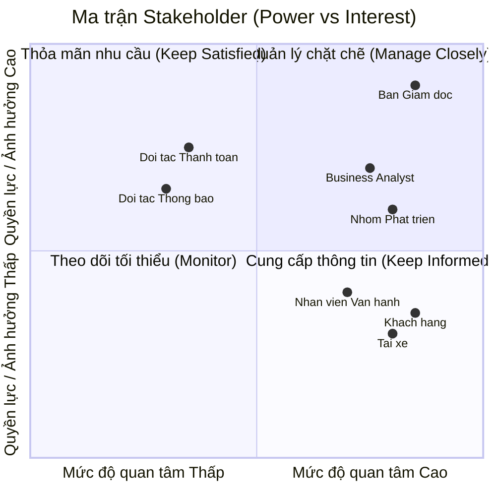

# Software Requirements Specification (SRS) - CAB System

## 1. Stakeholder Matrix (Ma trận Bên liên quan)

```mermaid
quadrantChart
    title Ma trận Stakeholder (Power vs Interest)
    x-axis "Mức độ quan tâm Thấp" --> "Mức độ quan tâm Cao"
    y-axis "Quyền lực / Ảnh hưởng Thấp" --> "Quyền lực / Ảnh hưởng Cao"
    quadrant-1 "Quản lý chặt chẽ (Manage Closely)"
    quadrant-2 "Thỏa mãn nhu cầu (Keep Satisfied)"
    quadrant-3 "Theo dõi tối thiểu (Monitor)"
    quadrant-4 "Cung cấp thông tin (Keep Informed)"
    
    "Ban Giam doc": [0.85, 0.90]
    "Business Analyst": [0.75, 0.70]
    "Nhom Phat trien": [0.80, 0.60]
    "Doi tac Thanh toan": [0.35, 0.75]
    "Doi tac Thong bao": [0.30, 0.65]
    "Khach hang": [0.85, 0.35]
    "Tai xe": [0.80, 0.30]
    "Nhan vien Van hanh": [0.70, 0.40]
```
